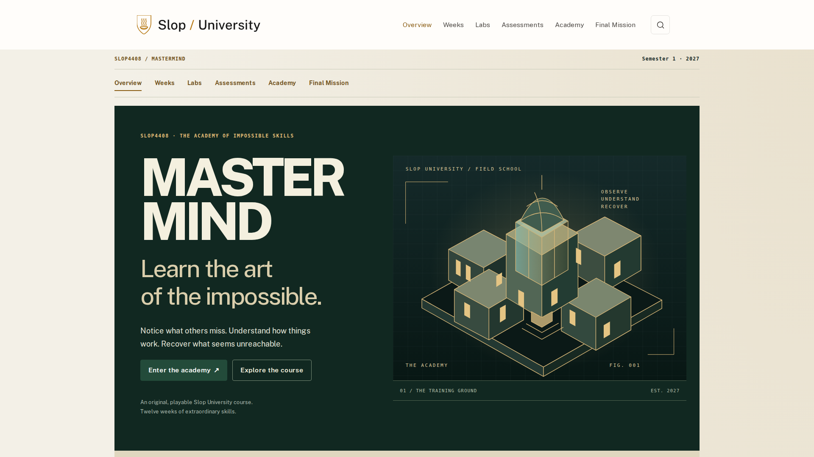

# Process overview

I wanted a course students would remember immediately, built around becoming a mastermind. The attraction was learning unusual skills together: observation, memory, mechanisms, electronics, digital investigation and coordinating a crew. My view of a good course is that its theme gives students a reason to practise, while each week changes what they can do in the same larger problem. Good reasoning should matter more than a lucky outcome.

The site's design references support that position: [How to Make Almost Anything](https://fab.cba.mit.edu/classes/863.25/) illustrates capabilities accumulating across a semester, while [ANU's teaching pages](https://comp.anu.edu.au/courses/comp1720/lectures/) provide direct access to dated material. In the harness, those ideas become reusable weekly outputs and academic pages accessible independently of game progress.

My first approved plan emphasised decisions under uncertainty. The harness in [4c8495d](https://github.com/comp4020-agentic-coding-studio/comp4020-ass2-Adithya-Rama/commit/4c8495d) and implementation in [bc31705](https://github.com/comp4020-agentic-coding-studio/comp4020-ass2-Adithya-Rama/commit/bc31705) made that coherent, but I was dissatisfied: acquiring distinctive skills had become describing and organising a fictional plan. More atmosphere would not resolve that mismatch. I asked to reconsider the curriculum before rebuilding.

The breakthrough was asking for a complete learning experience for each skill. In [8aca1cd](https://github.com/comp4020-agentic-coding-studio/comp4020-ass2-Adithya-Rama/commit/8aca1cd), twelve capability models accumulate into Operation Last Light. A mechanism responds to its configuration; a diagnosis depends on measurements; changed evidence can invalidate a choice. I encoded practice, feedback, unfamiliar transfer and later reuse in [CLAUDE.md](CLAUDE.md). The [curriculum checks](spec/curriculum.test.ts) protect connections and assessment requirements; [training tests](spec/training-engine.test.ts) protect causal rules. The agent could choose implementation details within Astro, but could not replace the curriculum with disconnected activities.

When the academy direction worked, I asked whether students would understand the skill, genuinely practise it and want to return. I required a complete, similar but different demonstration for every lab and assessment. [454d568](https://github.com/comp4020-agentic-coding-studio/comp4020-ass2-Adithya-Rama/commit/454d568) added sixteen examples with Watch and Take Control modes. However, I later questioned whether they actually differed from students' assigned tasks. A demonstration that supplied the same answer would undermine the independent practice I wanted.

That question exposed a weakness in the harness: checking a difference label did not establish a different problem. In [1c215a0](https://github.com/comp4020-agentic-coding-studio/comp4020-ass2-Adithya-Rama/commit/1c215a0), the correction changed consequential reasoning, including a two-fault diagnosis and an unsigned request that cannot replace authoritative evidence. Renaming equipment would have been easier, but would leave students following the same solution. The revised rule compares examples with browser, campus and changed-condition cases; [specific tests](spec/example-separation.test.ts) protect those contrasts.

Verification followed the educational claim. The [comparison record](docs/EXAMPLE-SEPARATION-AUDIT.md) documents all sixteen examples, learner-control checks and desktop/phone inspection. Rendered review caught a misleading circuit supply label that passing answer checks had missed. The earlier [demonstration validation](docs/DEMONSTRATION-VALIDATION.md) remains a historical checkpoint. These are agent observations and automated evidence, not personal student playtesting I claim to have conducted. They establish particular behaviours, not enjoyment or learning.

I deliberately left originality, appeal, prose quality and the value of the skills to human judgement. My role is to decide what is worth learning and question substantial work that misses that purpose, even when checks pass. Students should arrive for the mastermind fantasy and leave better able to test assumptions and revise decisions. Local verification and publication remain separate.

*Edited with coding-agent assistance from my supplied [account and subsequent directions](docs/AUTHOR-NOTES.md).*

*Latest course-site and rubric review: [audit and validation record](docs/RUBRIC-AUDIT.md).*

