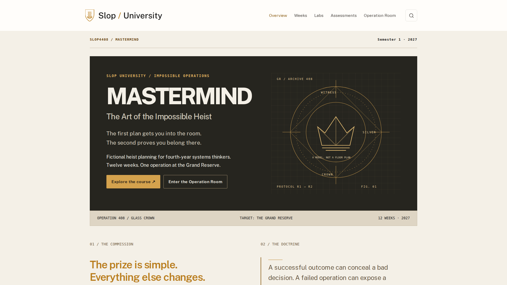

# Process overview

I chose the heist idea because I wanted the course to have a strong identity that a student would remember immediately. I liked the fantasy of becoming a mastermind and planning an impossible heist, but I did not want the course to depend only on its theme. It gave me a way to put students inside situations with incomplete information, conflicting evidence, different motivations and plans that can fail even when they initially look perfect.

What I really wanted students to learn was how to make and defend decisions under uncertainty. They should distinguish evidence from assumptions, understand dependencies, consider people's incentives and recognise when new information should change their plan. My approved direction became the working agreement in [4c8495d](https://github.com/comp4020-agentic-coding-studio/comp4020-ass2-Adithya-Rama/commit/4c8495d): one operation across twelve weeks, explicit sources, preserved revisions and direct access to the teaching.

The course-design references helped make that position concrete. [Calling Bullshit](https://callingbullshit.org/syllabus.html) sustains a position across its modules; [How to Make Almost Anything](https://fab.cba.mit.edu/classes/863.25/) connects weekly capabilities to larger work. In my course, each week changes the same operation. Students gather evidence, model the fictional system, form a crew and build a plan. Their later work depends on those records, which gives the early exercises a purpose beyond completing a worksheet.

The central decision was to build towards a complete plan halfway through the semester and then break one of its assumptions. I wanted students to revise it without pretending the original mistake never happened. The implementation in [bc31705](https://github.com/comp4020-agentic-coding-studio/comp4020-ass2-Adithya-Rama/commit/bc31705) keeps the provisional rule and Version 1 available while a new document requires Version 2. The checks verify preservation and source relationships; the browser journey saves an original, makes a revision and checks that both explanations remain visible. This makes revision something a student can inspect.

I also wanted to separate a good decision from a lucky outcome. A student should be able to fail the fictional heist and still demonstrate excellent reasoning. That became the assessment principle: evidence, reasoning, revision and defence matter, rather than simply winning. The rehearsal tests cover all 432 complete routes and establish predictable endings. They cannot establish whether a student's explanation is thoughtful. That judgement belongs with a reader.

The implementation review exposed a similar boundary in the website. Static checks passed while screenshots revealed a clipped hero and unreadable phone slides. A later browser audit found weak contrast in small gold text. The correction in [7ac8f66](https://github.com/comp4020-agentic-coding-studio/comp4020-ass2-Adithya-Rama/commit/7ac8f66) also strengthened the harness: inspect rendered content, use actual keyboard events, and verify the backup downloaded after storage fails. The [validation record](docs/VALIDATION.md) identifies these as agent-run observations, with their limits.

My aim remains for someone to arrive because the mastermind academy sounds fun and leave having practised careful thinking when information, people and conditions refuse to stay fixed. Automated checks protect the course's promises; coherence, voice and the quality of its reasoning still require personal judgement. Publishing is deferred to me, so local results are not presented as live-site acceptance.

*Edited with coding-agent assistance from my supplied [original account](docs/AUTHOR-NOTES.md).*

