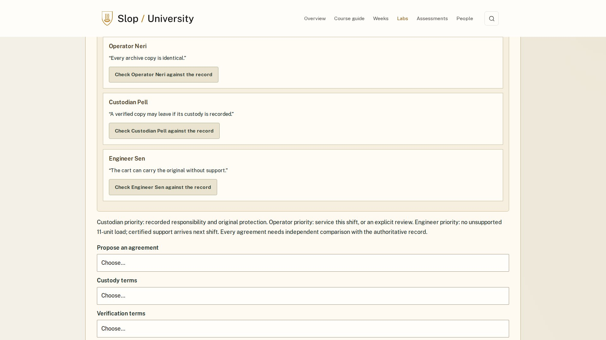

# Process overview

I chose the mastermind academy because I wanted students to remember its identity immediately. The attraction was learning unusual capabilities through an impossible operation. My view of a good course is that the theme gives students a reason to practise, while each week develops something they can use again. I wanted students to distinguish evidence from assumptions, understand dependencies and people's incentives, and revise a decision when its conditions change. A lucky game outcome should not outweigh weak reasoning.

My initial direction became the harness in [4c8495d](https://github.com/comp4020-agentic-coding-studio/comp4020-ass2-Adithya-Rama/commit/4c8495d) and the dossier course in [bc31705](https://github.com/comp4020-agentic-coding-studio/comp4020-ass2-Adithya-Rama/commit/bc31705). It was coherent, but I was dissatisfied: describing a plan did not deliver the distinctive skill practice I wanted. I asked to reconsider the curriculum. The academy redesign in [8aca1cd](https://github.com/comp4020-agentic-coding-studio/comp4020-ass2-Adithya-Rama/commit/8aca1cd) introduced observation, memory, mechanisms, electronics, investigation and crew coordination through responsive teaching models.

I then required complete demonstrations that students could watch or control. They needed to explain the task, show decisions and finish with the resulting work. I also challenged whether the examples differed meaningfully from assigned exercises. The correction in [1c215a0](https://github.com/comp4020-agentic-coding-studio/comp4020-ass2-Adithya-Rama/commit/1c215a0) changed consequential reasoning, including a two-fault diagnosis. Changing names alone would have left students copying a solution.

The experience still mattered. I wanted students to feel like agents investigating an obstacle, applying a skill and seeing its consequence. The performed missions in [c062cfb](https://github.com/comp4020-agentic-coding-studio/comp4020-ass2-Adithya-Rama/commit/c062cfb) addressed that direction. I subsequently insisted that the surrounding website introduce a university course: purpose, audience, outcomes, workload, assessments and staff. In-person teaching became the preferred route, with the online academy supporting students unable to attend and those revising.

My latest question was whether we had built escape-room training. I requested a hard critique, considered another model's critique, and approved a revised plan. One question now connects the semester: how can a team complete a fictional field operation with incomplete information, unreliable equipment and different responsibilities? That does not require every lab to end with a delivery. An investigation, diagnosis or negotiated agreement can be its own meaningful result.

The [revision](https://github.com/comp4020-agentic-coding-studio/comp4020-ass2-Adithya-Rama/commit/8936152) changed the instructions and checks. [CLAUDE.md](CLAUDE.md) requires clear controls without supplying the assessed decision, consequential transfer tasks and final requirements determined by the chosen approach. Memory compares strategies, diagnosis requires observations before repair, and negotiation allows competing feasible agreements. The final digital approach does not require transporting the original. The [implementation review](docs/INDEPENDENT-LEARNING-REVIEW.md) records these changes and their verification.

The agent's review found that changing a diagnosis could retain old completion credit, a read-only measurement could erase progress, and an earlier draft needed preservation before replacement. Those findings produced regression checks and corrected state handling. They are agent observations, not personal student playtests. Browser journeys examine controls, exports and responsive behaviour; they cannot establish enjoyment or learning.

I deliberately leave originality, appeal and educational value to human judgement. I remain responsible for challenging substantial work when it misses the purpose. The intended result is someone who arrives for the agent fantasy and leaves better able to observe, investigate, diagnose, coordinate and defend a decision. Local verification and publication remain separate.

*Edited with coding-agent assistance from my supplied [account and directions](docs/AUTHOR-NOTES.md).*

*Evidence: [curriculum revision](docs/INDEPENDENT-LEARNING-REVIEW.md) · [rubric audit](docs/RUBRIC-AUDIT.md).*

